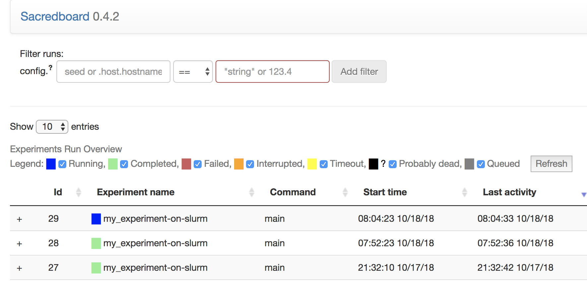
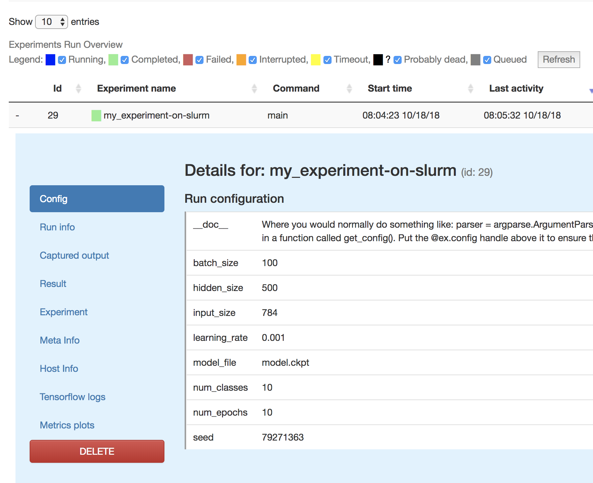
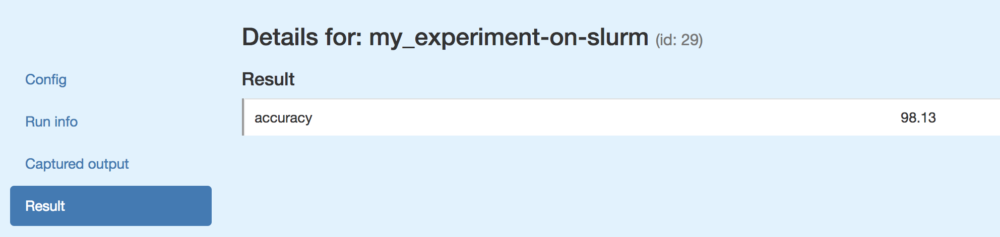

# Sacred Example Code Pytorch

To just quote its [documentation](https://sacred.readthedocs.io): ‘Sacred is a tool to 
configure, organize, log and reproduce computational experiments’. Sacred's
[documentation](https://sacred.readthedocs.io) itself is great. However, I figured some nice
sample code was missing, that shows you how you run a full project. 

In this repo you can find the code for a very simple feed forward neural network in Pytorch,
where we make use of Sacred. The code is based on [Yunjey's code](https://github.com/yunjey/pytorch-tutorial/tree/master/tutorials/01-basics/feedforward_neural_network), 
but quite heavily adapted for the current example. All the lines that are there for Sacred
are commented with '#sacred'.

## Usage 

### To just run from the command line

```npm
python train_nn.py with num_epochs=10
```

### To run with a job file on a cluster that uses Slurm

```
sbatch train_nn.job
```

## Sacredboard
You display all your results with [Sacredboard](https://github.com/chovanecm/sacredboard).
To run Sacredboard for the current setup:

```
sacredboard -m my-database
```

### Some examples

Overview of some runs


Overview of config


Overview of config


Overview of config

